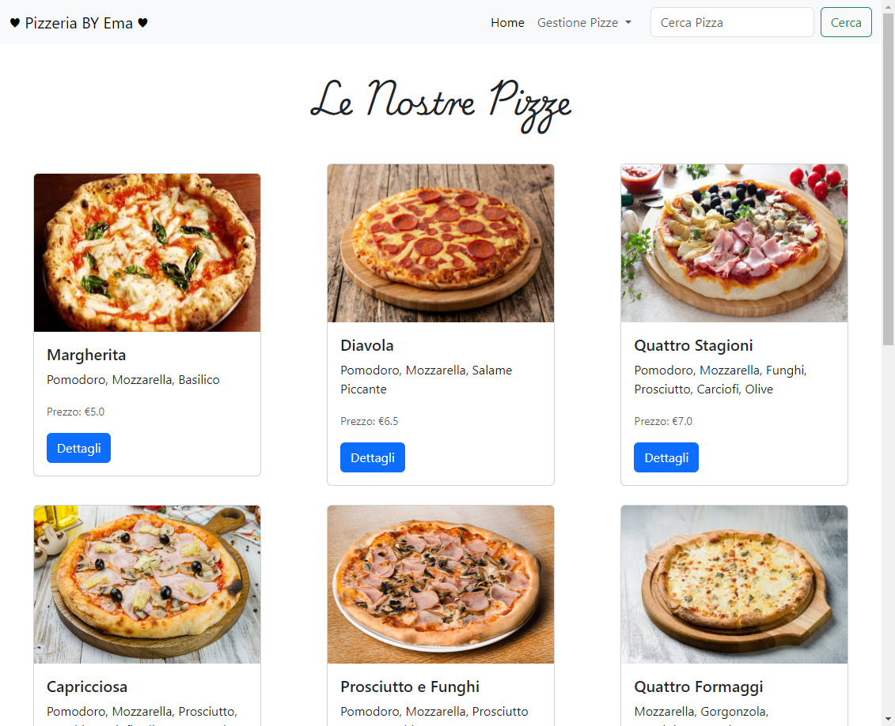
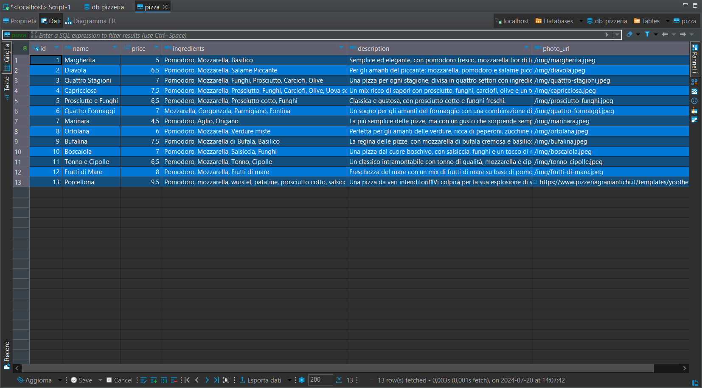
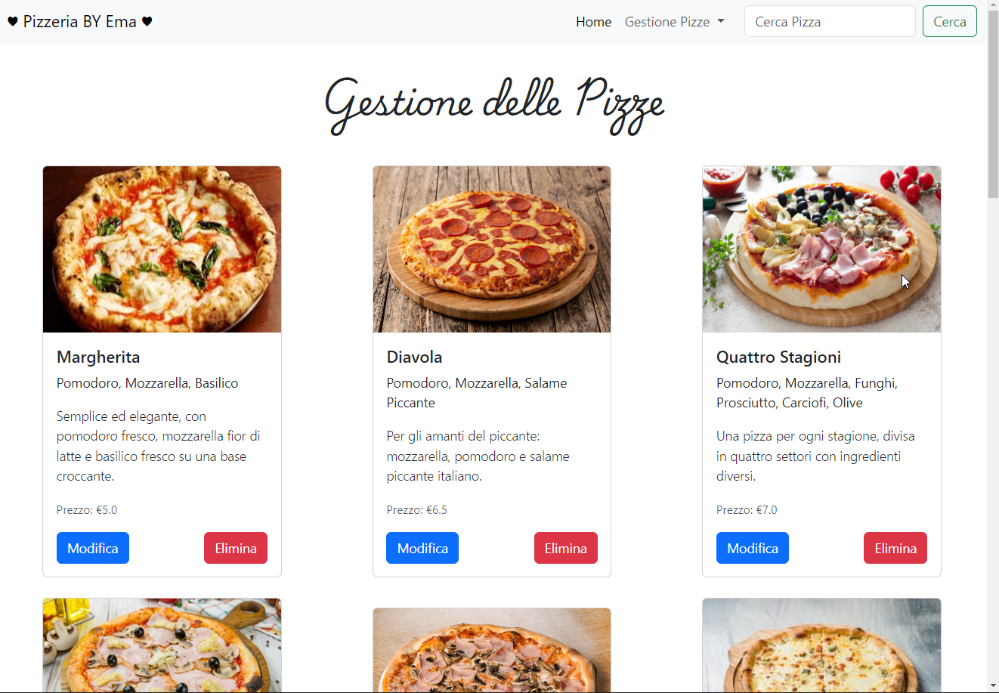
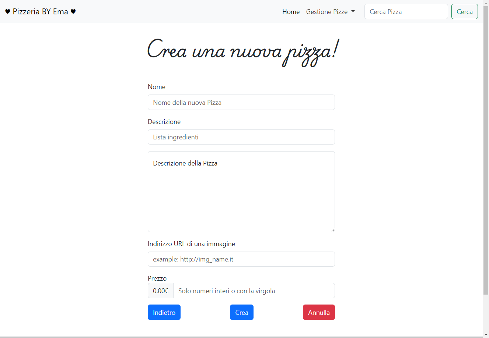
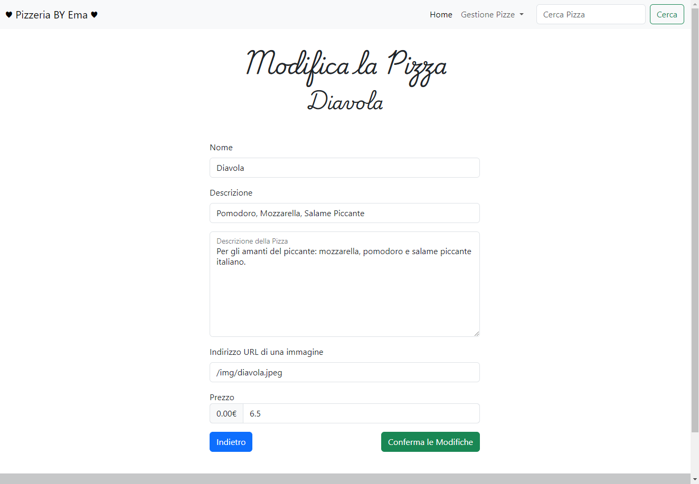

# spring-la-mia-pizzeria-crud
Dobbiamo realizzare un’applicazione web che ci aiuti a gestire la nostra pizzeria.

## Index

## db_pizzeria - MySQL

## Gestione

## Form Nuova Pizza

## Form Modifica Pizza Esistente

## PARTE 1
Abbiamo bisogno di creare la prima pagina (index) dove mostriamo tutte le pizze che prepariamo.
Nei prossimi giorni implementeremo il resto dei metodi per le CRUD.
Una pizza avrà le seguenti informazioni :
- un nome
- una descrizione
- una foto (url)
- un prezzo
Creaimo il database, repository e l'entity per gestire le CRUD delle pizze.
Implementiamo  quindi il controller con il metodo index che restituisce una view per mostrare l’elenco delle pizze caricate dal database (possiamo creare una tabella con bootstrap o una qualche grafica a nostro piacimento che mostri questo elenco...un po’ di creatività se vogliamo!)
L’elenco potrebbe essere vuoto : in quel caso dobbiamo mostrare un messaggio che indichi all’utente che non ci sono pizze presenti nella nostra applicazione.
Gestiamo i componenti riutilizzabili con i fragments.

## PARTE 2
Ogni pizza dell’elenco avrà quindi un pulsante che se cliccato ci porterà a una pagina che mostrerà i dettagli della pizza scelta.
Dobbiamo quindi inviare l’id come parametro dell’URL, recuperarlo nel metodo del controller, caricare i dati della pizza ricercata e passarli come model.
La view a quel punto li mostrerà all’utente con la grafica che preferiamo.
Nella pagina con l’elenco delle pizze aggiungiamo un campo di testo che se compilato filtrerà le pizze (lato server) aventi come titolo quello inserito dall’utente.

_______________________________________________________________________________________________

## nuove implementazioni per la nostra applicazione.
Abbiamo la lista delle pizze, abbiamo i dettagli delle pizze...perchè non realizzare la pagina per la creazione di una nuova pizza?
Aggiungiamo quindi tutto il codice necessario per mostrare il form per la creazione di una nuova pizza e per il salvataggio dei dati in tabella.
Nella index creiamo ovviamente il bottone “Crea nuova pizza” che ci porta a questa nuova pagina creata.
Ricordiamoci che l’utente potrebbe sbagliare inserendo dei dati : gestiamo quindi la validazione!
Ad esempio verifichiamo che :
- i dati della pizza siano tutti presenti
- il campi di testo non superino una certa lunghezza
- il prezzo abbia un valore valido (ha senso una pizza con prezzo minore o uguale a zero?)
Buon lavoro!! :slightly_smiling_face:
Se è stata spiegata la validazione custom, aggiungere alla consegna il seguente bonus

____________________________________________________________________________________________________

## andiamo avanti col nostro progetto.
Completiamo le pagine di gestione delle nostre pizze!
Abbiamo la pagina con la lista di tutte le pizze, quella con i dettagli della singola pizza, quella per crearla...cosa manca?
Dobbiamo realizzare :
- pagina di modifica di una pizza
- cancellazione di una pizza cliccando un pulsante presente nella grafica di ogni singolo prodotto mostrato nella lista in homepage
Buon lavoro!!

